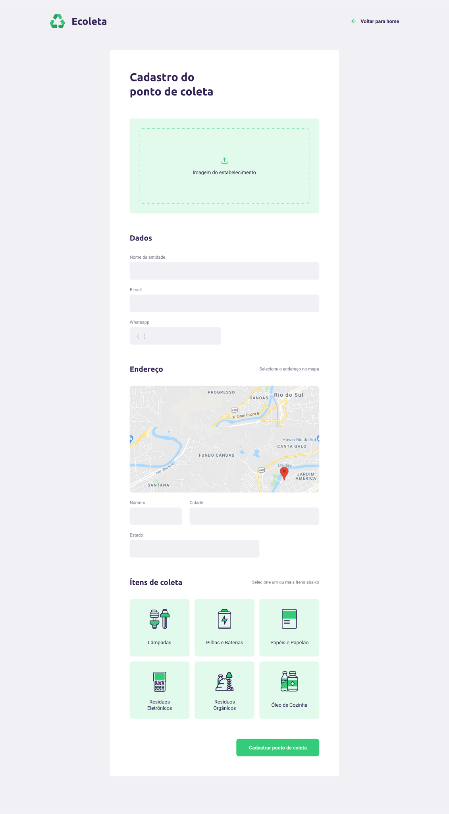

# Next Level Week

Este é um evento online organizado pela [Rocketseat](https://rocketseat.com.br/) com o intuito de desenvolver uma aplicação com Node(backend), ReactJS(frontend) e ReactNative(mobile).

A aplicação chama-se **Ecoleta**, ela tem o objetivo de unir empresas ou entidades
que coletam resíduos - lâmpadas, baterias, pilhas e entre outros - com pessoas que
desejam descartar algum tipo de resíduo.

## Como utilizar o Ecoleta?

### Backend 🧠

- Entre na pasta backend e execute `yarn install` ou `npm install` para instalar as dependências do Node;
- Agora para gerar o banco de dados Sqlite execute o comando `yarn knex:migrate` ou `npx knex:migrate`;
- Para povoar a tabela com alguns itens de coletas pré-definidos execute o comando `yarn knex:seed` ou
  `npx knex:seed`;
- Por último, para colocar o servidor no ar rode um `yarn start` ou `npm run start`.

### Frontend 👀

- Entre na pasta frontend e execute `yarn install` ou `npm install` para instalar as dependências do ReactJS;
- Agora para subir a aplicação WEB rode `yarn start` ou `npm start`;
- Para utilizar a aplicação entre no seu navegador e cole o endereço `http://localhost:3000`.

## Telas

### Home (Desktop)

### Cadastro (Desktop)

### Home (Mobile)

### Detalhes (Mobile)

